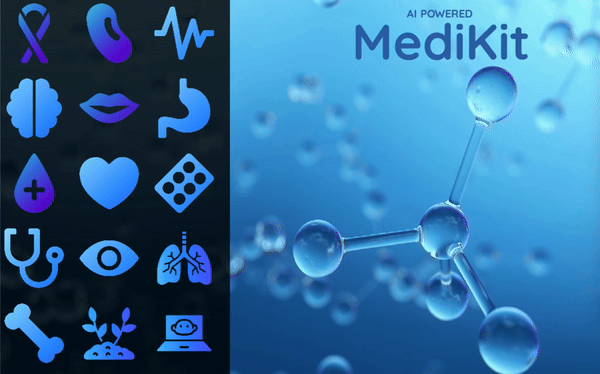

# ☤ AI-Powered-MediKit
AI Powered MediKit - A Bundle Service specially made for Medical Niche

# Get Models
⚙️ Download models from [PLETHORA OF MODELS](https://drive.google.com/drive/folders/1_ruz4r9T4pgJNosVuI7wbODNqQPQ_Pt4?usp=sharing) and keep them all in "models" folder in pwd of main.py

# To RUN
⚙️ python3 main.py

# Make SURE 
⚙️ You have all the models... (You can train yours by vit_trainer.py from utils folder, if you want to ✌🏻) 
⚙️ You have installed all the requirements provided

# Datasets are <a href="https://www.kaggle.com/aravindariharasudhan/datasets">HERE</a>
